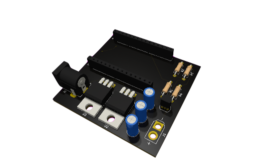
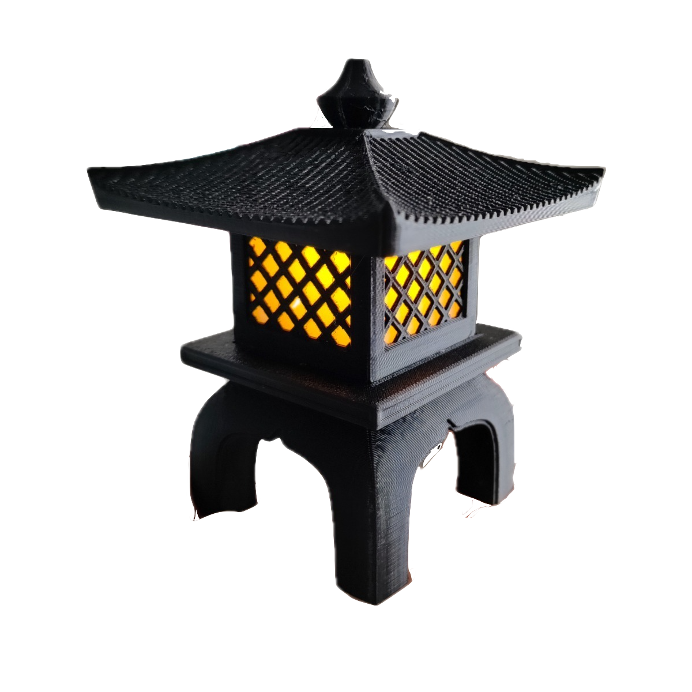
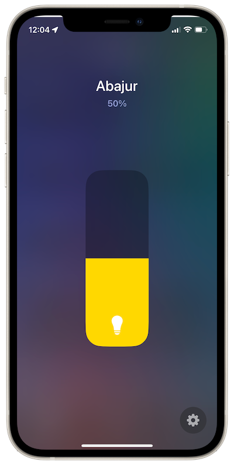
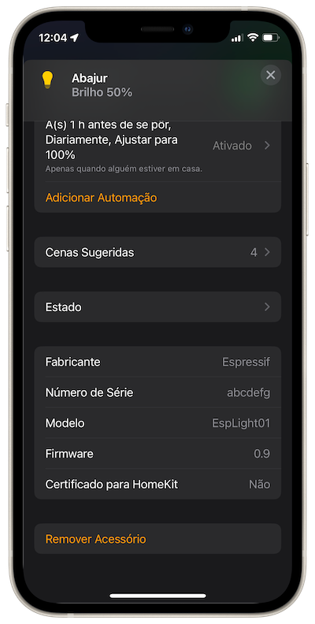
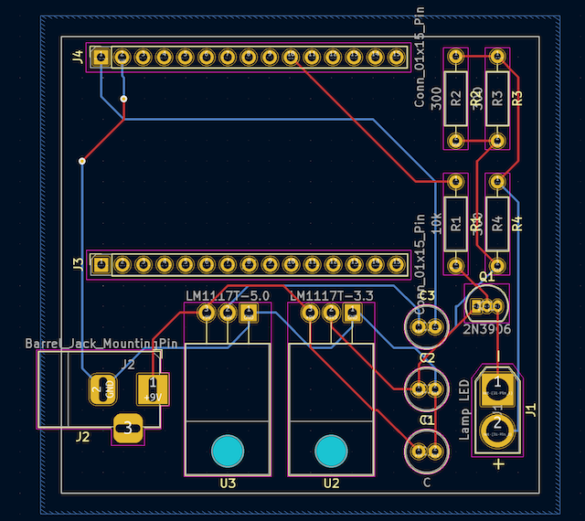

# Lamp Controller with Apple HomeKit


<p>
    
    
</p>

## Overview

This project is a smart lamp controller designed for a 3V3 3D printed lamp. It utilizes an ESP32 microcontroller and integrates seamlessly with Apple's HomeKit ecosystem. The project consists of both software and hardware components, making it a complete solution for controlling the lamp remotely.


## Software

The software component of this project is based on the following technologies:

- [esp-idf](https://github.com/espressif/esp-idf): Espressif's IoT Development Framework.
- [esp-homekit-sdk](https://github.com/espressif/esp-homekit-sdk): A library for building HomeKit accessories for Espressif chips.

### Installation

Follow the installation instructions for [esp-idf](https://github.com/espressif/esp-idf), then clone [esp-homekit-sdk](https://github.com/espressif/esp-homekit-sdk). Then clone this repository:
```shell
git clone https://github.com/vinepb/HomeKit-Lamp-Controller.git
```
Then set the device's serial port and flash:
```shell
$ cd /path/to/lightbulb
$ export ESPPORT=/dev/tty.SLAB_USBtoUART # Set your board's serial port here
$ idf.py set-target esp32
$ idf.py flash monitor
```

As the device boots up, you will see two QR codes, a small one for HomeKit and a larger one for Wi-Fi provisioning. Please use any of the [Espressif Provisioning Apps](https://docs.espressif.com/projects/esp-idf/en/latest/esp32/api-reference/provisioning/provisioning.html#provisioning-tools) for Wi-Fi provisioning.

> Note: For the Open source HomeKit SDK, the HomeKit QR code cannot be used for provisioning from the Home app. It can be used only for pairing, after the Wi-Fi provisioning is done. For provisioning from Home app, you will need the MFi variant of the SDK.

> Note: If you want to use hard-coded credentials instead of Provisioning, please set the ssid and passphrase by navigating to `idf.py menuconfig -> App Wi-Fi -> Source of Wi-Fi Credentials -> Use Hardcoded`

After the device connects to your Home Wi-Fi network it can be added in the Home app

### Add acccessory in the Home app

Open the Home app on your iPhone/iPad and follow these steps

- Tap on "Add Accessory" and scan the small QR code mentioned above.
- If QR code is not visible correctly, you may use the link printed on the serial terminal or follow these steps:
    - Choose the "I Don't Have a Code or Cannot Scan" option.
    - Tap on "Esp-Light-xxxxxx" in the list of Nearby Accessories.
    - Select the "Add Anyway" option for the "Uncertified Accessory" prompt.
    - Enter 11122333 as the Setup code.
- You should eventually see the "Esp-Light-xxxxxx added" message.
- Give a custom name, assign to a room, create scenes as required and you are done.

## Hardware

The hardware component of ths project was designed using [KiCad](https://www.kicad.org) and includes a schematic and a PCB layout.

### PCB Layout



### List of Materials

| Component           | Quantity | Footprint                                        |
|---------------------|----------|--------------------------------------------------|
| Resistor 10k Ohm    | 1        | Resistor_THT:R_Axial_DIN0207_L6.3mm_D2.5mm_P10.16mm_Horizontal |
| Resistor 300 Ohm    | 3        | Resistor_THT:R_Axial_DIN0207_L6.3mm_D2.5mm_P10.16mm_Horizontal |
| Transistor 2N3906   | 1        | Package_TO_SOT_THT:TO-92_Inline                |
| Capacitor 10uF      | 3        | Capacitor_THT:C_Radial_D5.0mm_H11.0mm_P2.00mm |
| Regulator LM1117T 3V3 | 1      | Package_TO_SOT_THT:TO-220-3_Horizontal_TabDown |
| Regulator LM1117T 5V | 1       | Package_TO_SOT_THT:TO-220-3_Horizontal_TabDown |
| ESP32-WROOM-32      | 1        | DEVKIT V1                                        |
| Jack P4 Female      | 1        | Connector_BarrelJack:BarrelJack_Horizontal_3pin |
| 15x Pin Socket       | 2        | 2.54mm vertical                                  |
| Lamp Connector      | 1        | Connector_AMASS_XT30U-F_1x02_P5.0mm_Vertical  |
| 1m Red AWG 20 Cable   | 1        | -                                                |
| 1m Black AWG 20 Cable | 1        | -                                                |
| 9VDC P4 Power Supply  | 1        | -                                                |
